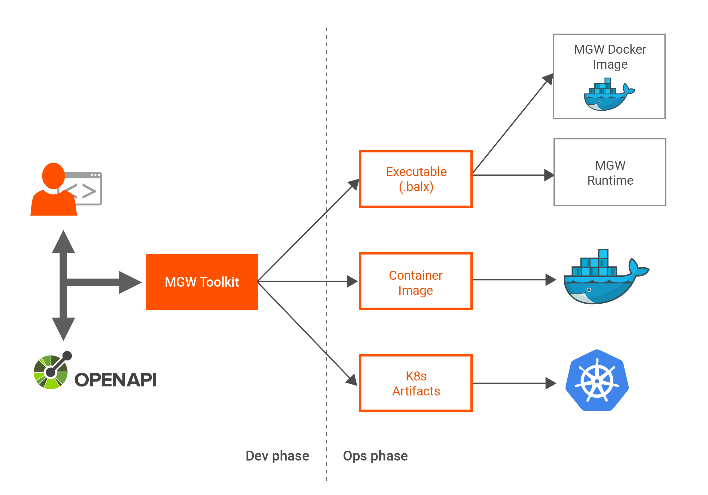

# API Microgateway Documentation

**Welcome to WSO2 API Microgateway 3.1.0 Documentation!** [WSO2 API
Microgateway](https://wso2.com/api-management/api-microgateway/) (WSO2
MGW) is an API Gateway for micro services, which is cloud-native,
decentralized and developer centric.

